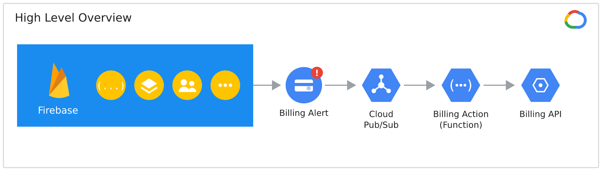
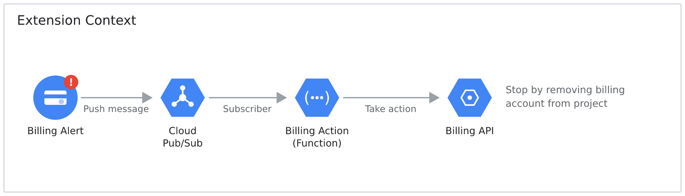
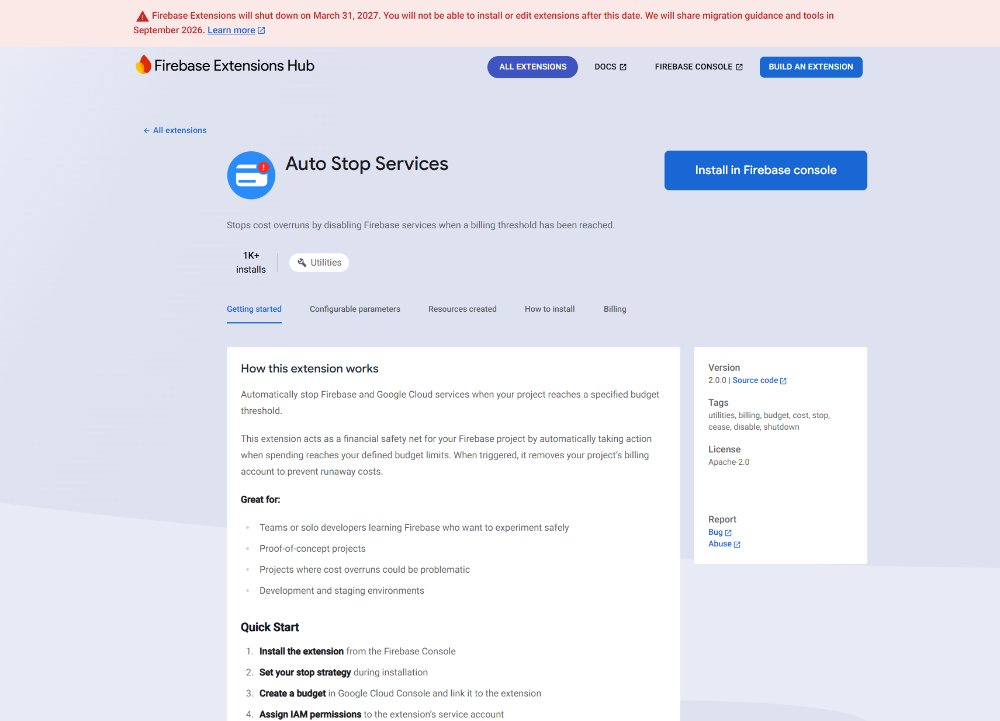

GCP's billing alerts fire when you cross a threshold, but nothing actually stops running because of it. On a dev project that's how a stuck job or a bad autoscaler config turns into real money before anyone notices. I built a Firebase Extension that removes the project's billing account when an alert fires, which suspends every paid service straight away.

It's two functions under the hood: one runs once, at install, to wire up the Pub/Sub subscription, the other runs on every alert and does the actual cutoff.

I listed it on the Firebase Extensions Hub under Apache-2.0, and it picked up over a thousand installs before Firebase shut the Hub down.

Source is on [GitHub](https://github.com/deep-rock-development/auto-stop-firebase-ext).
