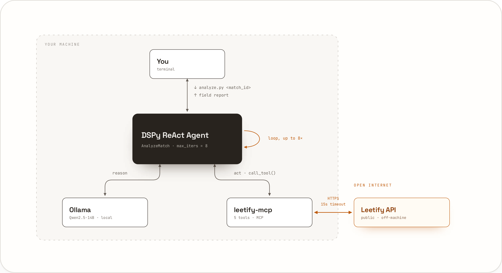

## Why

I wanted a report after every CS2 match: a standout moment, an honest read on my utility usage, one concrete thing to work on next time. Leetify already tracks the stats, but turning a wall of numbers into something worth reading meant an LLM, and I didn't want match data or API keys leaving my own machine to get it. So the whole thing runs locally: a local model, a local tool server, nothing calling out to a cloud provider.

## What it looks like

Run it against a match ID (or nothing, for your most recent match) and it writes a short markdown report. Something like:

> **Standout performance:** Carried the second half, going 14-6 after the side switch on Mirage, including the pistol round.
>
> **Notable moment:** A 3k on the anti-eco round in the low teens likely swung momentum back your way, based on the multi-kill counts for that half.
>
> **Utility notes:** Utility rating of 41.2/100. Volume was fine, ten flashes thrown, but only two landed on enemies (flashbang_hit_foe), and one flashed your own teammate. The rating is measuring effectiveness, not how much you threw.
>
> **Improvement tip:** Work on flash timing before peeks rather than throwing on entry, that's where the two friendly flashes came from this match.

## Architecture

Four pieces, wired together to keep everything on the host:

- **Ollama**, serving Qwen2.5 14B, running natively rather than in a container so it gets direct GPU access.
- **leetify-mcp**, a custom MCP server wrapping Leetify's public API (`api-public.cs-prod.leetify.com`), exposed as tools for player ratings, match stats, and trend data.
- **A DSPy ReAct agent**, capped at eight reasoning iterations, that decides which tools to call and writes the final report.
- **`analyze.py`**, the CLI entry point.


*Everything stays on your machine except the one HTTPS call leetify-mcp makes out to Leetify's public API.*

The agent talks to leetify-mcp over MCP's streamable HTTP transport, and to Ollama through DSPy's LM interface. leetify-mcp exposes three tools the agent can call: match stats for one specific player (already filtered, so it can't accidentally mix in a teammate's numbers), that player's category ratings (aim, positioning, utility, clutch, opening), and their trend across recent matches.

## Keeping it honest

The part I spent the most time on isn't the agent, it's making sure it doesn't make things up. Every number the agent puts in a report gets checked against the real match and profile data before the report counts as good: I extract every number that appears in the generated text, and every number that appears in the real API response for that match, and require the report's numbers to be a subset of the real ones (a few numeric-formatting variants aside, like `41` vs `41.0`). A report that states a rating or a kill count that isn't actually in the data fails the check.

That's also why the prompt is so specific about where each claim has to come from. Raw stats only give counts, like how many flashbangs were thrown, not a quality score, so the agent is instructed to never state a "rating" for anything unless it actually called the ratings tool. And when a category rating seems to conflict with the raw counts (utility rating low despite throwing a lot of grenades), the agent is told to explain the gap using the effectiveness fields, like flashes that actually landed on an enemy, rather than just stating both numbers side by side and leaving the reader to reconcile them.

## Tuning the prompt

Rather than hand-editing the agent's instructions and examples, they're tuned with DSPy's optimizers: BootstrapFewShot adds worked examples, MIPROv2 rewrites the instructions themselves. The optimized version only gets loaded automatically if there's a saved `optimized_miprov2.json`.

Re-running the optimizer builds its training set from real usage, logged to `run_log.jsonl` as the agent gets used. It only overwrites the deployed version if the new one doesn't score worse on a fixed comparison set, so a re-optimization run can't silently make the agent worse and ship that.

## Running it

The MCP server and the agent run as two processes; Ollama stays on the host either way. Locally:

```
cd mcp/leetify_mcp
python server.py
```

and in another terminal:

```
cd agent
python analyze.py <match_id>
```

Every run saves its report to `agent/reports/<match_id>.md`. There's also a Docker path that runs leetify-mcp and the agent together in one container, with Ollama still reachable on the host via `OLLAMA_HOST=http://host.docker.internal:11434`.
