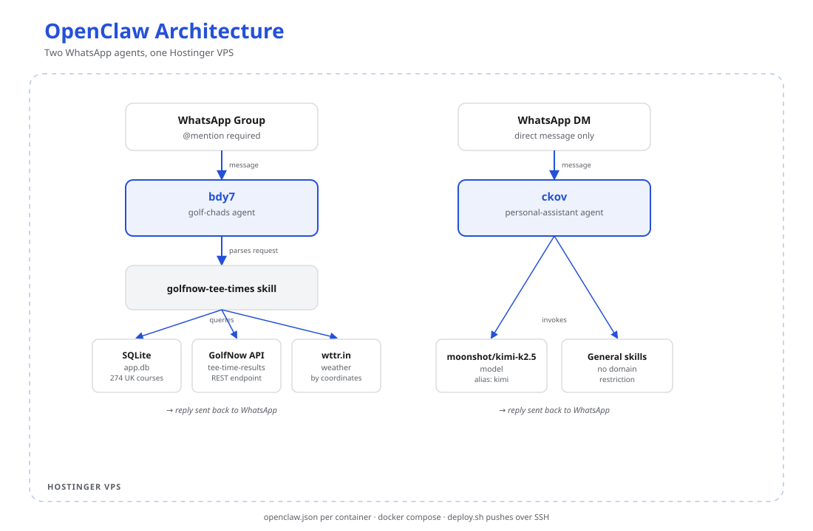

## Why

I wanted an excuse to actually build something with OpenClaw, and golf gave me one. I play regularly, and checking tee times the normal way means opening GolfNow, picking a course and a date, and reading through whatever's available, every time, for every course my group might want to play. I wanted a bot in our WhatsApp group that could suggest tee times, track the ones we're considering, and eventually book on our behalf.

This post is about the first piece: getting the bot to find and suggest tee times.

I run two WhatsApp bots on a single Hostinger VPS, both built on OpenClaw. They don't share anything except the runtime and the machine: different phone numbers, different ports, different agent configs, deployed and operated the same way. Alongside the golf bot, I also run a general-purpose assistant that responds to direct messages only.

## What it looks like

In the group chat:

> **me:** @golf-chads any tee times at Silloth on Saturday?
>
> **golf-chads:** Silloth on Saturday, 24 Aug. 3 slots after 9am: 9:20, 10:40, 12:10. Forecast: partly cloudy, 16°C, light wind.

That's the whole interaction. One message in, one reply back. The rest of this post is about what happens in between.

## Two agents, one VPS

Each bot runs as its own OpenClaw container. The container named `bdy7` runs the **golf-chads** agent, which only responds in a WhatsApp group when it's @mentioned. The container named `ckov` runs the **personal-assistant** agent, which only responds to direct messages and has no restriction on what topics it can help with.

*Two containers, two agents, sharing a VPS and nothing else.*

| Component | What it is |
|---|---|
| WhatsApp Group | Entry point for golf-chads. Requires an @mention to trigger a response. |
| WhatsApp DM | Entry point for personal-assistant. Responds only to direct messages. |
| `bdy7` | Docker container running the golf-chads agent, port 49927. |
| `ckov` | Docker container running the personal-assistant agent, port 50464. |
| golfnow-tee-times skill | Parses the request and queries the three sources below. |
| SQLite (`app.db`) | Local database of 274 UK golf courses, used to resolve a course name to a GolfNow facility ID. |
| GolfNow API | REST endpoint queried for tee-time availability. |
| wttr.in | Weather lookup for the course's coordinates. |
| moonshot/kimi-k2.5 | The model backing personal-assistant, aliased as `kimi` in config. |
| General skills | personal-assistant's skill set. No domain restriction. |

## The golfnow-tee-times skill

This is the part of golf-chads that does the actual work, and it's simpler than I expected it to be going in. GolfNow has a public REST API, so the skill calls it directly instead of automating a browser session.

For a single request, the skill does the following:

1. Extracts the course name and date from the message.
2. Looks up the course in the local SQLite database to find its GolfNow facility ID.
3. Sends that facility ID and date to GolfNow's `tee-time-results` endpoint.
4. Fetches weather for the course's coordinates from `wttr.in`.
5. Combines both results into one reply.

One detail worth noting: the `sqlite3` command-line tool isn't installed in the container, so any manual query against the database has to go through `python3 -c "import sqlite3; ..."`. It's a minor inconvenience once you know about it.

## Configuration

Configuration for both bots lives in an `openclaw.json` file inside each container. Four sections matter most: `agents.list` defines which model and skills each agent uses, `bindings` maps a WhatsApp thread to an agent, `channels.whatsapp` sets the DM and group policies including the @mention requirement, and `gateway.controlUi` is kept restricted to localhost. Most configuration changes take effect by copying the updated file into the container and restarting the process, without a full container rebuild.

Skills are resolved from three locations, with the workspace directory taking priority: bundled, then managed, then workspace. Only the top level of the workspace skills directory is loaded automatically. A skill placed in a `public/` subfolder won't be picked up until it's moved up a level. I ran into this directly and it took a while to track down.

## Running it

Both bots are managed the same way, over SSH with Docker Compose. `docker compose up -d` starts a container from its own directory. A configuration change means copying the new `openclaw.json` file in and restarting the OpenClaw process so it picks up the change. If a WhatsApp session drops, reconnecting means running `openclaw channels login` inside the container and scanning a new QR code.

There's a health-check script, `scripts/eval.js`, that checks the process, the browser, the API connection, and the WhatsApp connection, and can optionally send the result to a WhatsApp DM.

Deployment is handled by a single script, `deploy.sh`, which pushes the full repository to the VPS over SSH. There's no separate build step. A full VPS snapshot is also kept in the repo along with re-provisioning instructions, in case the server itself needs to be rebuilt from scratch.
