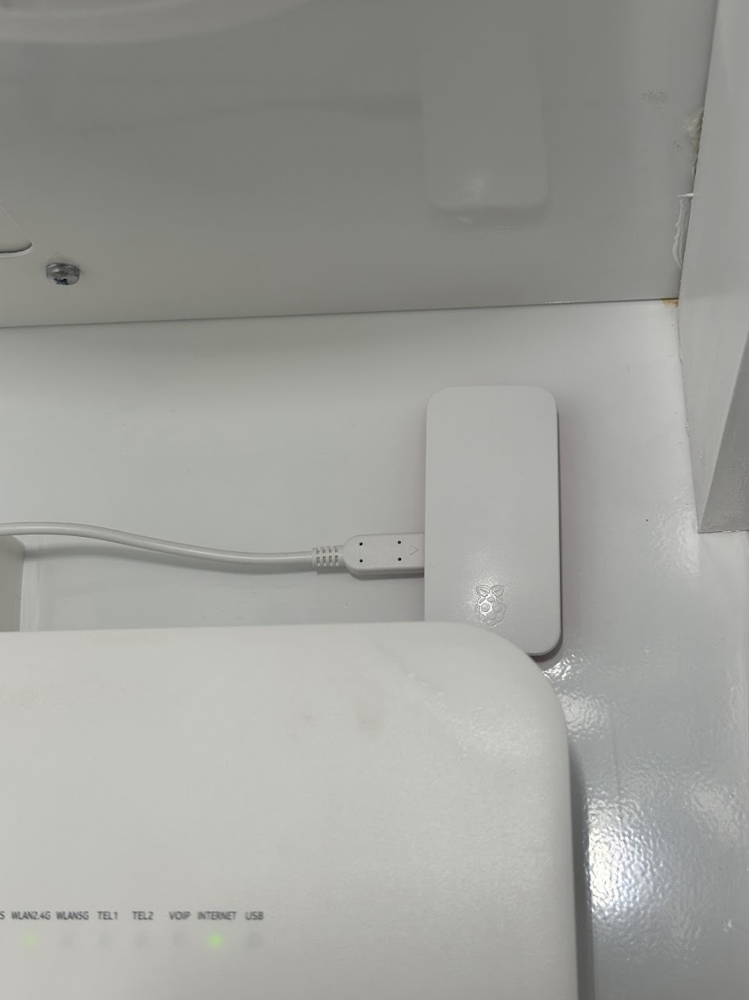

I've been wanting an excuse to actually use a Raspberry Pi. [Raspberry Pi's official Pi-hole tutorial](https://www.raspberrypi.com/tutorials/running-pi-hole-on-a-raspberry-pi/) gave me one. Pi-hole blocks ads and trackers at the DNS level for every device on the network, rather than per device, which covers the smart TV, the tablet, and everything else that can't run a browser extension.

I followed the guide from start to finish. The broad shape of it:

- Flash Raspberry Pi OS Lite onto a microSD card, with SSH and Wi-Fi already configured so it joins the network on first boot.
- Run Pi-hole's install script over SSH, picking an upstream DNS provider and a blocklist along the way.
- Give the Pi a fixed IP address through a DHCP reservation on the router, so it doesn't change after a reboot.
- Point the router's DNS setting at that address, so every device on the network starts routing through it.

The tutorial covers each of those steps in full detail. It's worth reading directly if you're setting this up yourself.

It's running now, sitting quietly on the network and blocking a meaningful share of ad and tracking traffic without anything installed on any individual device.
