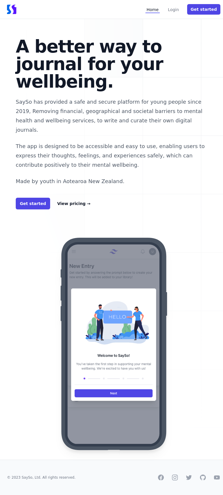

SaySo is a digital journal for mental wellbeing. We built the first version in 2020, a place to write and keep your own journal entries. A second version followed in 2023, adding sentiment analysis, AI, payment integration, and analytics on top of the core journaling.

It runs on Firebase and GCP, with Stripe handling the subscription billing.

Live at [sayso-project.com](https://sayso-project.com).
